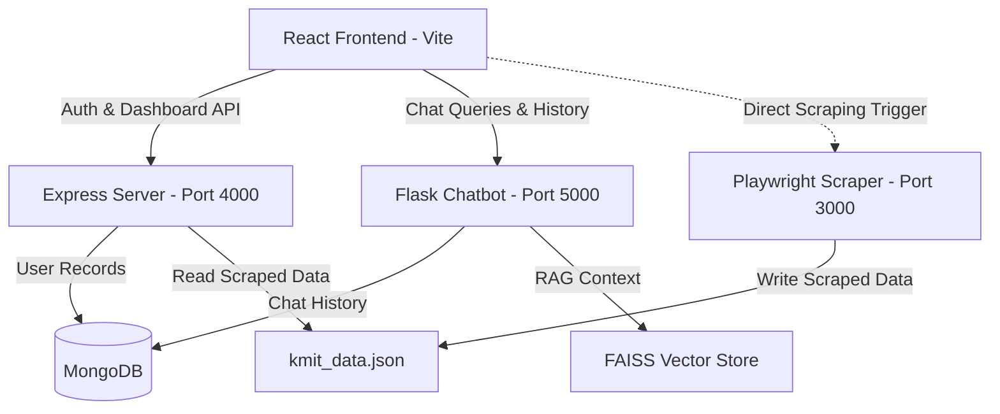

# 🚀 Campus Genie (College Genie)

Campus Genie is a premium, fully integrated academic assistant portal designed specifically for KMIT students. It combines a dynamic dashboard, automated portal scraping, secure authentication, and a RAG (Retrieval-Augmented Generation) chatbot powered by LangChain and OpenRouter.

---

## 🛠️ Architecture & Services

The application consists of four interconnected layers:



1. **Vite + React Frontend (Port 5173)**: Dynamic, responsive dashboard built with Framer Motion, Tailwind CSS, and Lucide React.
2. **Node.js Express Server (Port 4000)**: Handles user authentication, route protection, profile fetching, and reads/serves dashboard statistics. Connects to MongoDB.
3. **Python Flask Chatbot (Port 5000)**: LangChain RAG pipeline loading local FAISS embeddings (HuggingFace MiniLM model) and invoking OpenRouter LLMs. Connects to MongoDB to store chat history.
4. **Playwright Scraper (Port 3000)**: Script (`sa.py`) that logs into the student portal, retrieves current session attendance + weekly timetable, and outputs to a local cache.

---

## 📋 Prerequisites

Before running the project, make sure you have the following installed:
- **Node.js** (v18 or higher)
- **Python** (v3.10 or higher)
- **MongoDB** (running locally on port 27017)
- **OpenRouter API Key** (for chatbot answers)

---

## ⚙️ Setup Instructions

### 1. Environment Configuration
Create a `.env` file in the root directory:
```env
MONGODB_URI=mongodb://localhost:27017/campus-genie
JWT_SECRET=your_jwt_secret_key_here
PORT=4000
OPENROUTER_API_KEY=your_openrouter_api_key_here
OPENROUTER_MODEL=nvidia/nemotron-3-super-120b-a12b:free  # Or any other model
```

### 2. Frontend & Auth Server (Node.js)
Install Node dependencies:
```bash
npm install
```

### 3. Chatbot & Scraper Server (Python)
We recommend using a virtual environment:
```bash
# Create virtual environment
python -m venv venv

# Activate virtual environment
# On Windows:
venv\Scripts\activate
# On macOS/Linux:
source venv/bin/activate

# Install requirements
pip install -r requirements.txt

# Install Playwright browser engines
playwright install chromium
```

---

## 🏃 Run Instructions

You will need to launch each server in a separate terminal window:

### 1. Express Auth & Dashboard Backend (Port 4000)
```bash
node server.js
```

### 2. Flask Chatbot Backend (Port 5000)
Make sure your virtual environment is active and run:
```bash
python app.py
```

### 3. Netra Scraper Server (Port 3000)
Make sure your virtual environment is active and run:
```bash
python sa.py
```

### 4. React Frontend Development Server (Port 5173)
```bash
npm run dev
```
Open `http://localhost:5173` in your browser to access the portal!
